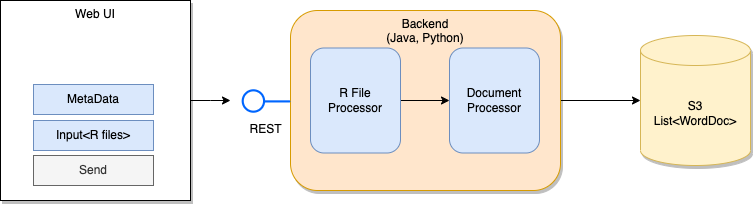

# R-extruder


## Overview

R-extruder is a Django-based application designed to simplify the process of generating plots from R scripts. Users can upload their R scripts, and the application will execute them, generating a Word document (.docx) containing images of the plots in PNG format.


## Prerequisites

Before running r-extruder, make sure you have the following installed:

- Python 3.9
- pip 23.3.1

## Installation

1. Navigate inside root folder:

   ```bash
   cd r-extruder
    ```
2. Install dependencies: 
   ```bash
   pip install -r requirements.txt
   ```
3. Run the Django development server:
    ```bash
   python manage.py runserver
   ```

   